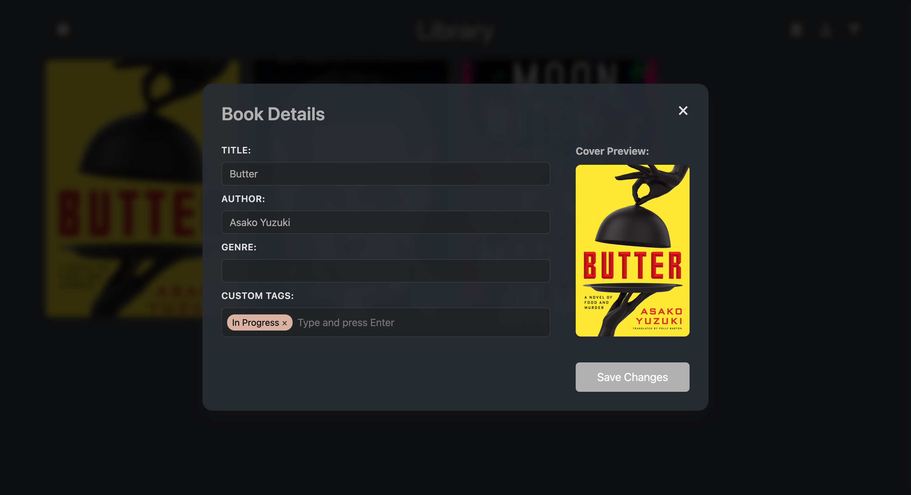
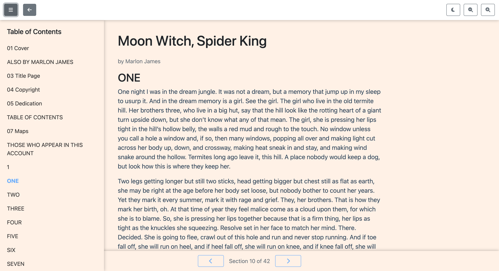
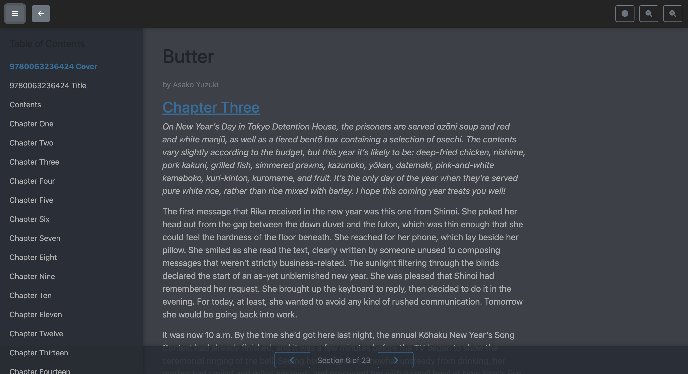

# INQUIRE: AI-Enhanced EPUB Library

## Overview








## Features

- **Book Management**
  - Upload and process EPUBs, with automatic parsing of metadata.
  - Customize book covers by uploading a new jpg or png.
  - Download books directly from the library.
  - Set access levels according to authentication and user roles.
  - Batch import functionality for multiple books.
- **EPUB Reader**
  - Seamless navigation and progress tracking which remembers where you've read up to.
  - Toggle dark mode and adjust font size to customise your reading experience.
  - Content streaming ensures lightning-fast delivery, even for massive epubs.
  - Mobile-friendly layout with intuitive controls.
  - Support for table of contents navigation.
  - Switch between scroll and paginated layouts; on wide screens, paginated mode shows a two-page spread like an open book.
  - `←` / `→` / `Space` flip pages in paginated mode; `Shift` + `←` / `→` jumps sections in either mode.
- **Library Views**
  - Cover grid (default), ordered by most recently added or last read.
  - Bookshelf view that renders each book as a spine on a wooden shelf — spine thickness scales with the book's length.
- **Filtering & Search**
  - Filter books by title, author, genre, or custom tags.
  - Track reading status with automatically generated tags for Unread, In Progress, and Finished books.
  - Advanced search with support for multiple criteria.
- **Dark Mode**
  - Toggle between light and dark themes effortlessly.
  - Persistent theme preference across sessions.
- **AI-Powered Reading Assistant**
  - Ask questions on highlighted text for deeper comprehension.
  - Get instant word definitions tailored to the current passage.
  - Translate selected text to English with context-aware accuracy.
  - Keyboard shortcuts for quick access on desktop (`Ctrl/Cmd + K`for questions, `D` for definitions, `L` for translations).

## Installation

1. **Clone the repository**:
   ```bash
   git clone https://github.com/ego-alt/library.git
   cd library
   ```

2. **Configure environment variables**:
   Create a `.env` file in the project root:
   ```bash
   ANTHROPIC_API_KEY=your_api_key_here
   BOOK_DIR=/path/to/your/books
   ```

3. **Mark the books directory**:
   The app refuses to boot unless `BOOK_DIR` contains a `.library-mount`
   sentinel file. This is a guard against a failed mount silently presenting
   an empty directory (which previously caused data loss).
   ```bash
   mkdir -p "$BOOK_DIR"
   touch "$BOOK_DIR/.library-mount"
   ```
   On a NAS/external-drive setup, create the sentinel on the *mounted* disk so
   it disappears whenever the mount fails.

4. **Build and run with Docker Compose**:
   ```bash
   docker compose up -d
   ```

5. **Alternative (local) setup**:
   Ensure you have Python (3.10+) and `uv` installed:
   ```bash
   uv sync
   uv run flask run --port=8002
   ```

## Home stack (with dashboard)

Served at `/library/` behind the [dashboard](../dashboard) nginx proxy. In that
mode, set:

```bash
AUTH_PROXY_HEADER=X-Forwarded-User
APPLICATION_ROOT=/library
```

Dashboard handles login; this app trusts the `X-Forwarded-User` header and keeps
its own `users` rows for bookmarks and tags. Omit both variables for standalone
dev (local login on port 8002).

After adding a user in dashboard, sync shadow accounts:

```bash
cd ../dashboard && uv run python scripts/sync_household_users.py
```

See `dashboard/README.md` for compose and user sync.

## Usage

- **Access the application**: Open your web browser and go to `http://127.0.0.1:8002`.
- **Upload Books**: 
  - Use the upload button in the top navigation bar.
  - Batch upload: Drag and drop multiple files in the upload area.
- **Manage Your Collection**: 
  - Download or view book details via the overlay buttons on each book cover. 
  - Organize books with custom tags.
  - Edit metadata including title, author, and cover image.
- **Filtering**: 
  - Use the sidebar to search by title, author, or genre. 
  - Filter by reading status (Unread, In Progress, Finished) or custom tags.
  - Combine multiple filters for precise results.
- **Read Books**: 
  - Click any book cover to read it directly within the browser -- no downloads necessary.
  - Use arrow keys to navigate between chapters.
  - Access the table of contents through the sidebar menu.
- **Bookmarking**: 
  - Reading position saves automatically while logged in and syncs across devices.

## Commands

The application includes several CLI commands for managing books:

- **Import Books**: Import EPUB files from a specified directory.
  ```bash
  uv run flask import-books --directory /path/to/epub/files
  ```

- **Refresh cover paths**: Re-scan each EPUB’s package document and update stored `cover_path` values (optional; serving covers no longer depends on this being perfect).
  ```bash
  uv run flask refresh-cover-paths
  ```

- **Create User**: Create a new user account.
  ```bash
  uv run flask create-user <username> <password> --role <role>
  ```

## Contributing

1. Fork the repository
2. Create your feature branch (`git checkout -b feature/new-feature`)
3. Commit your changes (`git commit -m 'Add some new feature'`)
4. Push to the branch (`git push origin feature/new-feature`)
5. Open a Pull Request