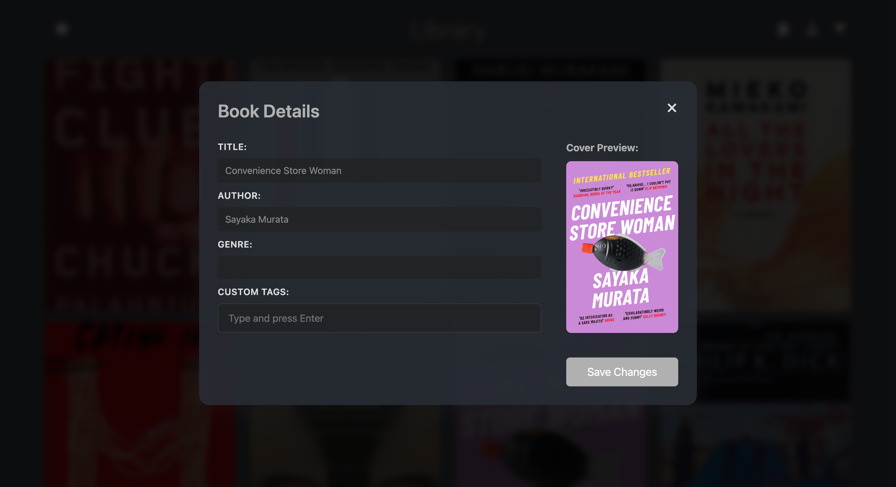

# EPUB Library Management System

## Overview





## Features

- **Book Management**
  - Upload and process EPUBs, with automatic parsing of metadata.
  - Customize book covers by uploading a new jpg or png.
  - Download books directly from the library.
  - Set access levels according to authentication and user roles.
  - Batch import functionality for multiple books.
- **EPUB Reader**
  - Seamless navigation and progress tracking which remembers where you've read up to.
  - Toggle dark mode and adjust font size to customise your reading experience.
  - Content streaming ensures lightning-fast delivery, even for massive epubs.
  - Mobile-friendly layout with intuitive controls.
  - Support for table of contents navigation.
- **Filtering & Search**
  - Filter books by title, author, genre, or custom tags.
  - Track reading status with automatically generated tags for Unread, In Progress, and Finished books.
  - Advanced search with support for multiple criteria.
- **Dark Mode**
  - Toggle between light and dark themes effortlessly.
  - Persistent theme preference across sessions.

## Installation

1. **Clone the repository**:
   ```bash
   git clone https://github.com/ego-alt/library.git
   cd library
   ```

2. **Build the Docker image**:
   ```bash
   docker build -t epub-library .
   ```

3. **Run the Docker container**:
   ```bash
   docker run -d -p 8002:8002 \
       -v <local_path_to_books>:/mnt/backup/books \
       -v $(pwd)/instance:/app/instance \
       epub-library
   ```

4. **Alternative (local) setup**

   Ensure you have Python (3.6+) installed and set up a virtual environment:
   ```bash
   python -m venv venv
   source venv/bin/activate   # On Windows use `venv\Scripts\activate`
   pip install -r requirements.txt
   flask run --port=8002
   ```

## Usage

- **Access the application**: Open your web browser and go to `http://127.0.0.1:8002`.
- **Upload Books**: 
  - Use the upload button in the top navigation bar.
  - Batch upload: Drag and drop multiple files in the upload area.
- **Manage Your Collection**: 
  - Download or view book details via the overlay buttons on each book cover. 
  - Organize books with custom tags.
  - Edit metadata including title, author, and cover image.
- **Filtering**: 
  - Use the sidebar to search by title, author, or genre. 
  - Filter by reading status (Unread, In Progress, Finished) or custom tags.
  - Combine multiple filters for precise results.
- **Read Books**: 
  - Click any book cover to read it directly within the browser -- no downloads necessary.
  - Use arrow keys to navigate between chapters.
  - Access the table of contents through the sidebar menu.
- **Bookmarking**: 
  - Reading position saves automatically while logged in and syncs across devices.

## Commands

The application includes several CLI commands for managing books:

- **Import Books**: Import EPUB files from a specified directory.
  ```bash
  flask import-books --directory /path/to/epub/files
  ```

- **Flush Books**: Remove books from the database that no longer exist in the specified directory.
  ```bash
  flask flush-books --directory /path/to/epub/files
  ```

- **Create User**: Create a new user account.
  ```bash
  flask create-user <username> <password> --role <role>
  ```

## Contributing

1. Fork the repository
2. Create your feature branch (`git checkout -b feature/new-feature`)
3. Commit your changes (`git commit -m 'Add some new feature'`)
4. Push to the branch (`git push origin feature/new-feature`)
5. Open a Pull Request